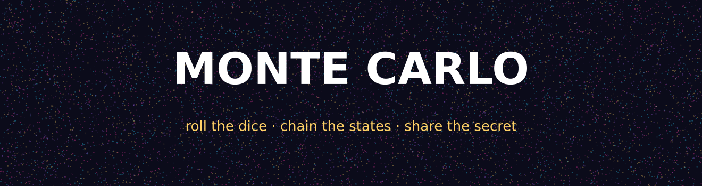
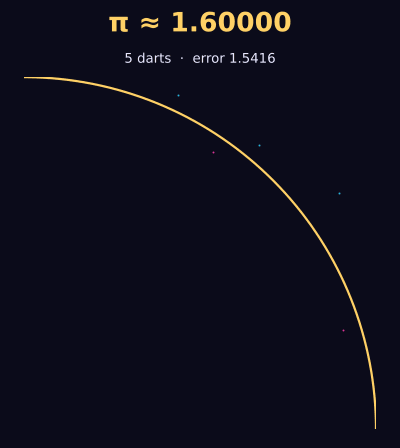
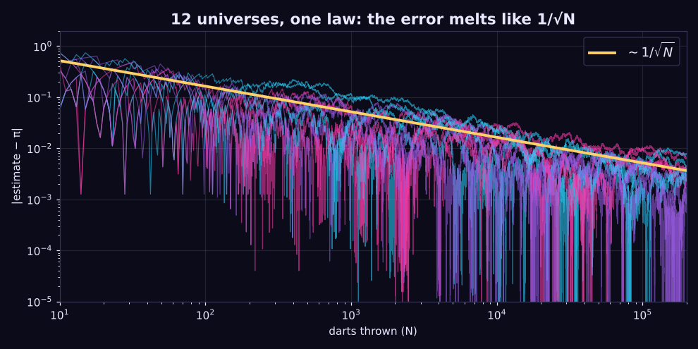
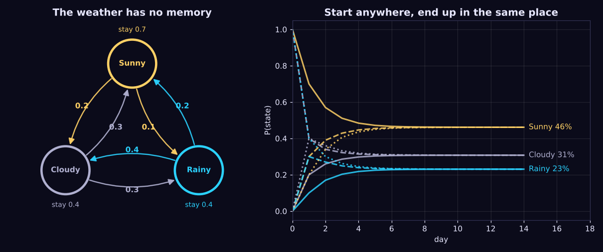
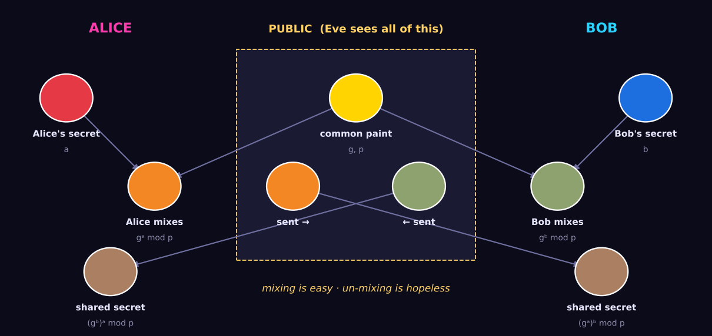

  

  <b>Three of the most beautiful ideas in mathematics. One interactive playground.</b> 
  <i>Throw darts at π. Teach the weather to forget. Whisper a secret in a crowded room.</i>

  
  
  

---

## 🎲 What is this?

**Monte Carlo** is an interactive teaching app (in the works) for three ideas that run the modern world while nobody's looking:

| | Concept | The one-line vibe |
|---|---|---|
| 🎯 | **The Monte Carlo Method** | *If you can't solve it, simulate it a million times and let randomness do the math.* |
| 🔗 | **Markov Chains** | *The future depends only on now. The past? Forgotten.* |
| 🔐 | **Diffie–Hellman Key Exchange** | *Two strangers agree on a secret while the whole world listens, and the world still learns nothing.* |

Each concept is pitched at **three audiences**, from 🧃 **teen** (games, darts, emoji) to ☕ **adult** (weather, investing, HTTPS) to 🧪 **scientist** (eigenvalues, variance reduction, elliptic curves). That's 9 learning tracks with sliders, live simulations, code labs and a few challenges designed to break your intuition.

---

## 🎯 Act I: Throwing darts at π

  

Here's a trick that feels like cheating:

1. Draw a square. Draw a quarter-circle inside it.
2. Throw darts **completely at random**.
3. Count how many land inside the curve.
4. Multiply that fraction by 4.

**You just computed π.** No geometry, no calculus, just chaos with a counter. The quarter-circle covers π/4 of the square, so random darts land inside it π/4 of the time. Throw enough of them and the universe tells you the answer.

The catch (and it's a deep one) is that **accuracy is expensive**:

  

Twelve independent runs, twelve wildly different wobbles, and every one of them is pinned under the same golden line: **error ∝ 1/√N**. Want 10× more accuracy? Throw **100× more darts**. That one law is why supercomputers exist, and why mathematicians invented clever tricks like importance sampling, control variates and quasi-random Sobol sequences to cheat it. (The scientist track lets you race them.)

### 📜 A short history of gambling with mathematics

- **1777 — The needle drops.** The Comte de **Buffon** asks: if you drop a needle on a floor of parallel planks, how often does it cross a line? The answer contains π. People later dropped thousands of needles by hand to estimate it. In 1901 Mario Lazzarini claimed 3.1415929 from 3,408 throws, a result so suspiciously perfect that historians still side-eye it.
- **1930s — Fermi's secret hobby.** **Enrico Fermi**, sleepless in Rome, used hand-calculated random sampling to predict neutron behaviour. He amazed colleagues with uncannily accurate predictions and never told them how.
- **1946 — Solitaire in a hospital bed.** **Stanisław Ulam**, recovering from encephalitis, kept playing Canfield solitaire and wondered what the odds of winning were. The combinatorics were brutal. Then it hit him: *why not just play a few hundred games and count?* He took the idea to **John von Neumann**, and they realised it could crack the neutron-diffusion problems at **Los Alamos**.
- **The name.** It was secret work, so it needed a code name. **Nicholas Metropolis** suggested *Monte Carlo*, after the casino in Monaco where Ulam's uncle would borrow money from relatives because he "just had to go to Monte Carlo."
- **1948 — ENIAC rolls the dice.** The first Monte Carlo calculations ran on **ENIAC**, with programs written largely by **Klára Dán von Neumann**. Von Neumann invented the "middle-square" pseudo-random generator for it and then famously quipped: *"Anyone who considers arithmetical methods of producing random digits is, of course, in a state of sin."*
- **1953 — The Metropolis algorithm.** Metropolis, **Arianna** and Marshall **Rosenbluth**, and Augusta and Edward **Teller** fuse Monte Carlo with Markov chains (see Act II), and **MCMC** is born. Arianna Rosenbluth wrote the code for the MANIAC computer. Today it powers Bayesian statistics, protein folding and machine learning.
- **1955 — Randomness becomes a bestseller.** The RAND Corporation publishes *A Million Random Digits with 100,000 Normal Deviates*, a 600-page book of pure noise. It is still in print, and its Amazon reviews are a genre of comedy.

Today Monte Carlo prices your pension, sets your insurance premium, renders Pixar movies (path tracing is Monte Carlo light), forecasts elections and plans rocket launches.

---

## 🔗 Act II: Markov chains, or the art of forgetting

  

Tomorrow's weather depends on **today**, and nothing else. Not last week, not last year. That's the **Markov property**, and it's what makes the system *memoryless*.

Now watch the right-hand chart. Start on a sunny day, a cloudy day or a rainy day, and the probabilities **always converge to the same place**: ~46% sunny, ~31% cloudy, ~23% rainy. That's the **stationary distribution**. Run the chain long enough and it forgets where it came from entirely. (Strictly speaking, that's only guaranteed for *ergodic* chains, which is the scientist track's rabbit hole.)

### 📜 A short history of a mathematical feud

- **1906 — A grudge match.** Russian mathematician **Andrey Markov** was furious. His rival **Pavel Nekrasov** claimed the Law of Large Numbers only works for *independent* events, and used that to argue for free will, theologically. Markov set out to prove him wrong by inventing a process where every event *depends* on the last one, yet the averages still settle down. Spite-driven research at its finest.
- **1913 — Pushkin, by hand.** To show it wasn't just abstract, Markov took the first **20,000 letters** of Pushkin's verse novel *Eugene Onegin* and tallied vowel→consonant transitions **by hand**. It was the first statistical language model, more than a century before ChatGPT.
- **1948 — Shannon's babble machine.** **Claude Shannon** used Markov chains over letters and words to generate eerily English-ish gibberish, which helped launch information theory.
- **1998 — Two grad students and a random surfer.** **Larry Page** and **Sergey Brin** modelled a bored web surfer clicking random links. The stationary distribution of *that* Markov chain is **PageRank**, and it made Google.

Your phone's predictive text, speech recognition, DNA sequence analysis, Snakes & Ladders and credit-rating models all run on Markov chains.

---

## 🔐 Act III: Diffie–Hellman, a secret shouted across a crowded room

  

Alice and Bob have **never met**. Eve is reading **every message** they send. Can they agree on a secret key?

It sounds impossible. It isn't:

1. 🟡 Everyone agrees on a public colour.
2. 🔴🔵 Alice and Bob each secretly pick their own colour and **never share it**.
3. 🟠🟢 Each mixes their secret into the public colour and sends the result out in the open.
4. 🟤 Each mixes *the other's* blend with their own secret, and they **both get the exact same brown**.

Eve sees yellow, orange and green. To get the brown she'd have to **un-mix paint**, which nobody can do.

In the real protocol the "paint" is modular arithmetic: `A = gᵃ mod p`. Computing it is easy. Reversing it means solving the **discrete logarithm problem**, which for 2048-bit primes would take longer than the universe has existed. In the teen track you play Eve with tiny numbers (p = 23) and win easily. Then p grows, and grows again, until you can't.

### 📜 A short history of the key that changed everything

- **For thousands of years**, every cipher had the same fatal flaw: to talk securely, you first had to *meet* (or trust a courier) to share a key. Armies, embassies and banks all ran on locked briefcases.
- **1974 — Merkle's puzzles.** Berkeley undergrad **Ralph Merkle** proposed public key agreement as a class project. His professor rejected it. His paper was rejected too, for being "not in the mainstream of cryptographic thinking."
- **1976 — "We stand today on the brink of a revolution in cryptography."** That's the opening line of **Whitfield Diffie** and **Martin Hellman**'s paper *New Directions in Cryptography*. Public-key cryptography went public, and the NSA was not thrilled.
- **The twist.** At Britain's GCHQ, **James Ellis**, **Clifford Cocks** and **Malcolm Williamson** had secretly discovered the same ideas (Williamson found the DH-equivalent around 1974). It stayed classified until **1997**.
- **2015.** Diffie and Hellman receive the **Turing Award**, computing's Nobel.

Every padlock 🔒 in your browser bar, every SSH session, every VPN tunnel and every Signal or WhatsApp message starts with a Diffie–Hellman handshake (these days usually on elliptic curves). You've done one of these handshakes dozens of times since you started reading this page.

---

## 🌀 The plot twist: they're all the same idea

| | Randomness is used for… |
|---|---|
| 🎯 Monte Carlo | **estimation**: random samples reveal hidden truths |
| 🔗 Markov | **prediction**: random steps reveal long-run behaviour |
| 🔐 Diffie–Hellman | **security**: random secrets that no one can guess |

And they collide: **Markov Chain Monte Carlo** is the engine of modern Bayesian AI, while the **random numbers** that make simulations fast are exactly the kind you must *never* use for crypto keys (the app uses a seedable PRNG for one and `crypto.getRandomValues` for the other).

---

## 🗺️ What's planned

| | 🧃 Teen | ☕ Adult | 🧪 Scientist |
|---|---|---|---|
| 🎯 **Monte Carlo** | Dart-throwing game + "Pi Champion" challenge | Investment portfolio simulator, confidence intervals | Variance reduction showdown, Halton/Sobol quasi-MC |
| 🔗 **Markov** | Text predictor, playlist shuffler | Weather simulator, editable 3×3 matrix | N×N matrix lab, eigenvalues, mixing times |
| 🔐 **Diffie–Hellman** | Paint-mixing game, "Be Eve" | TLS handshake walkthrough, MITM attack | Cyclic groups, elliptic-curve DH, code lab |

**Stack:** Vite · React · TypeScript · Zustand · Framer Motion · Canvas · CodeMirror 6 · KaTeX · Tailwind · Radix UI

📚 Deep dives: **[research.md](research.md)** (the concepts, audiences and sources) · **[plan.md](plan.md)** (architecture and build order)

---

## 🧪 Status

**Research & planning.** The ideas are mapped and the architecture is drawn. The visuals above were made with [a small Python script](scripts/generate_readme_assets.py): real simulations, real random numbers. The app itself is next, starting with Monte Carlo because darts are the most fun.

---

## 📄 License

[MIT](LICENSE) © 2026 Chris Brooksbank

<i>“The best way to understand randomness is to play with it.”</i> 🎲

